# Actively-vs-passively-managed-funds
Here I want to show how to download data of a managed fund from a dynamic graph from a website and then compare it with a passively managed index. Furthermore, I would like to perform a risk assessment.

# Download
First, I want to download from a web page with an interactive chart the data.

I would like to show a comparison between an active managed fund and a passive fund. As an actively managed fund I use the "Allianz AktivDepot Plus Chancenreich (https://de.allianzgi.com/de-de/unsere-fonds/allianz-aktiv-depot/profil-chancenreich)" Since the fund has no ISIN or WKN number, I will download the data from the interactive chart from an official website.

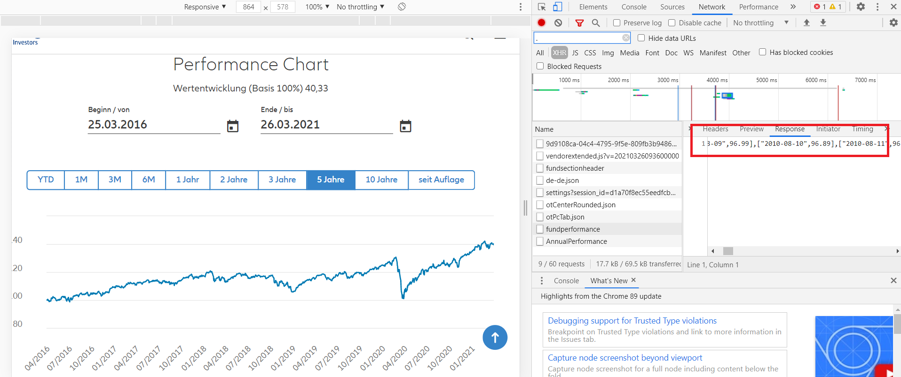

For this go to the page and change to the expert mode "CRT+F12" Here go into the Network mode, select XHR and reload the page again. I find the entry "fundperformance" and click on "Response", here now I see the data as text and save it as an Excel file ("C:/.../activly_managed_fund.xlsx").


# Comparision
Now I would like to make a comparison with a passively managed fund, once over the total period and then each year


## Total time period

````python
# Download passive managed fond
# Time
start1 = '2010-04-15 00:00:00'
end1 = '2020-12-31 00:00:00'
data = 0
data = web.DataReader(['XWD.TO'],'yahoo',start1,end1)
print('')

# Value 
Startvalue1 = data.Close.iloc[0][0]
print('Startvalue: ' + str(round(Startvalue1,2)))
Endvalue1 = data.Close.iloc[-1][0]
print('Endvalue:   ' + str(round(Endvalue1,2)))
print('')

# time period
Startdate1 = data.index[0]
print('Startdate ' + str(Startdate1))
Enddate1 = data.index[-1]
print('Startdate ' + str(Enddate1))

print('')
deltadays1 = Enddate1 - Startdate1
print('Number of days considered: ' + str(deltadays1.days))

# Conversion days to years
deltadays1 = float(deltadays1.days)
years1 =  deltadays1/365.25
print('Converted into years: ' + str(round(years1,2)))

# reciprocal value 
n1 = 1/years1
#print(n)

print('')
# compound interest
p1 = 100*(((Endvalue1/Startvalue1)**n1)-1)
print('Annual compound interest: ' + str(round(p1,2)))

print('')
print('')
print('')


import pandas as pd
actively_managed_fund = pd.read_excel("C:/.../activly_managed_fund.xlsx")
actively_managed_fund = actively_managed_fund[actively_managed_fund['Date'].between(start1, end1)]

# value 
Startvalue2 = actively_managed_fund.Value.iloc[0]
print('Startvalue: ' + str(round(Startvalue2,2)))
Endvalue2 = actively_managed_fund.Value.iloc[-1]
print('Endvalue:   ' + str(round(Endvalue2,2)))
print('')

# time period
Startdate2 = actively_managed_fund.Date.iloc[0]
print('Startdate ' + str(Startdate2))
Enddate2 = actively_managed_fund.Date.iloc[-1]
print('Startdate ' + str(Enddate2))

print('')
deltadays2 = Enddate2 - Startdate2
print('Number of days considered: ' + str(deltadays2.days))

# Conversion days to years
deltadays2 = float(deltadays2.days)
years2 =  deltadays2/365.25
print('Converted into years: ' + str(round(years2,2)))

# reciprocal value 
n2 = 1/years2
#print(n)

print('')
# compound interest
p2 = 100*(((Endvalue2/Startvalue2)**n2)-1)
print('Annual compound interest: ' + str(round(p2,2)))


# figure
fig, ax1 = plt.subplots(figsize=(15,6))
ax1.grid(color='black', linestyle='--', linewidth=0.1)
ax1.set_xlabel('date')
ax1.set_ylabel('growth')
label1 = 'MSCI World compound interest p.a. ' + str(round(p1,2)) + '%'
ax1.plot(data.index, data.Close/data.Close.iloc[0], label=label1)

label2 = 'Actively Managed Fund compound interest p.a. ' + str(round(p2,2)) + '%'
ax1.plot(actively_managed_fund.Date, actively_managed_fund.Value/actively_managed_fund.Value.iloc[0], label=label2)

ax1.tick_params(axis='y')
ax1.grid(b=None, which='major', axis='both', linewidth=0.2, linestyle='-')
ax1.legend()
fig.tight_layout()
````

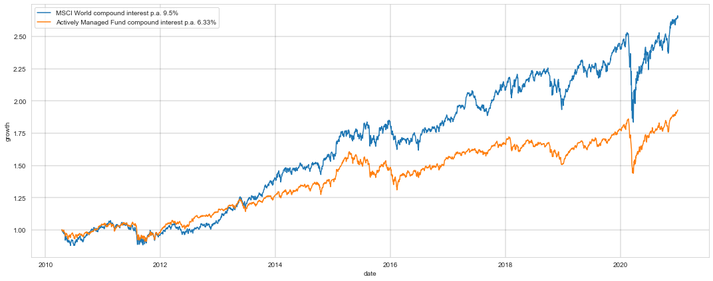


## Annual comparison
```` python
Start = ['2010-04-15','2011-01-01','2012-01-01','2013-01-01','2014-01-01','2015-01-01','2016-01-01','2017-01-01','2018-01-01','2019-01-01','2020-01-01','2021-01-01']
End = ['2010-12-31','2011-12-31','2012-12-31','2013-12-31','2014-12-31','2015-12-31','2016-12-31','2017-12-31','2018-12-31','2019-12-31','2020-12-31','2021-03-22',]

for x in range(0,12):
    print('')
    print('')
    print(Start[x] + " - " + End[x])
    data = 0
    data = web.DataReader(['XWD.TO'],'yahoo',Start[x],End[x])
    print('')

    # Value
    Startvalue1 = data.Close.iloc[0][0]
    print('Startvalue: ' + str(round(Startvalue1,2)))
    Endvalue1 = data.Close.iloc[-1][0]
    print('Endvalue:   ' + str(round(Endvalue1,2)))
    print('')

    # Time period
    Startdate1 = data.index[0]
    print('Startdate ' + str(Startdate1))
    Enddate1 = data.index[-1]
    print('Enddate ' + str(Enddate1))

    print('')
    deltadays1 = Enddate1 - Startdate1
    print('Number of days considered: ' + str(deltadays1.days))

    # Converted into years
    deltadays1 = float(deltadays1.days)
    years1 =  deltadays1/365.25
    print('Converted into years: ' + str(round(years1,2)))

    # reciprocal value 
    n1 = 1/years1
    #print(n)

    print('')
    # compound interest
    p1 = 100*(((Endvalue1/Startvalue1)**n1)-1)
    print('Annual compound interest: ' + str(round(p1,2)))

    print('')
    print('')
    print('')

    import pandas as pd
    actively_managed_fund = pd.read_excel("C:/.../activly_managed_fund.xlsx")
    actively_managed_fund = actively_managed_fund[actively_managed_fund['Date'].between(Start[x], End[x])]

    # Value 
    Startvalue2 = actively_managed_fund.Value.iloc[0]
    print('Startvalue: ' + str(round(Startvalue2,2)))
    Endvalue2 = actively_managed_fund.Value.iloc[-1]
    print('Endvalue:   ' + str(round(Endvalue2,2)))
    print('')

    # time period
    Startdate2 = actively_managed_fund.Date.iloc[0]
    print('Startdate ' + str(Startdate2))
    Enddate2 = actively_managed_fund.Date.iloc[-1]
    print('Enddate ' + str(Enddate2))

    print('')
    deltadays2 = Enddate2 - Startdate2
    print('Number of days considered: ' + str(deltadays2.days))

    # Conversion days to years
    deltadays2 = float(deltadays2.days)
    years2 =  deltadays2/365.25
    print('Converted into years: ' + str(round(years2,2)))

    # reciprocal value 
    n2 = 1/years2
    #print(n)

    print('')
    # Compound interest
    p2 = 100*(((Endvalue2/Startvalue2)**n2)-1)
    print('Annual compound interest: ' + str(round(p2,2)))    
    
    
    fig, ax1 = plt.subplots(figsize=(15,6))
    ax1.grid(color='black', linestyle='--', linewidth=0.1)
    ax1.set_xlabel('Date')
    ax1.set_ylabel('Growth')
    label1 = 'MSCI World compound interest p.a. ' + str(round(p1,2)) + '%'
    ax1.plot(data.index, data.Close/data.Close.iloc[0], label=label1)

    label2 = 'actively_managed_fund compound interest p.a. ' + str(round(p2,2)) + '%'
    ax1.plot(actively_managed_fund.Date, actively_managed_fund.Value/actively_managed_fund.Value.iloc[0], label=label2)

    ax1.tick_params(axis='y')
    ax1.grid(b=None, which='major', axis='both', linewidth=0.2, linestyle='-')
    ax1.legend()
    fig.tight_layout()
    filename = Start[x] + ".png"
    fig.savefig(filename, bbox_inches='tight')
````

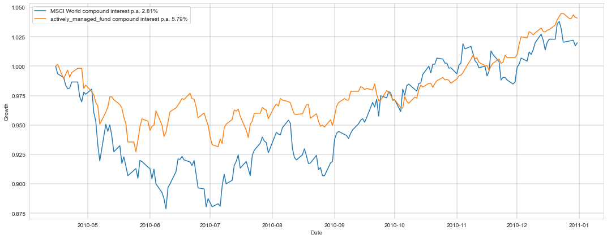
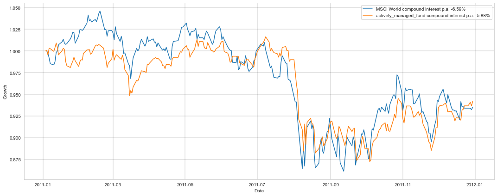
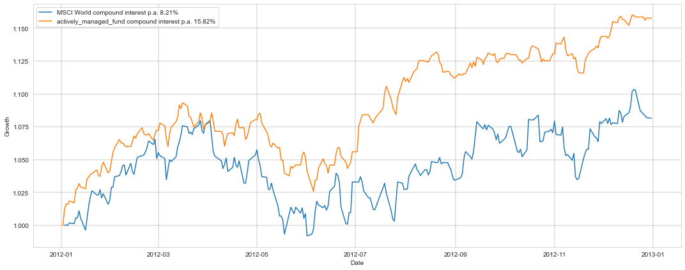
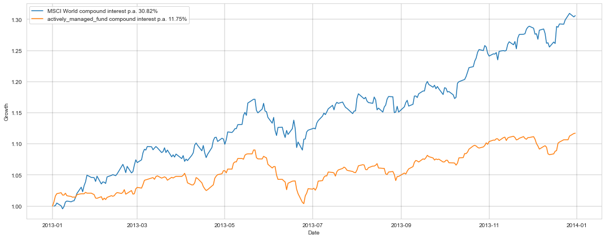
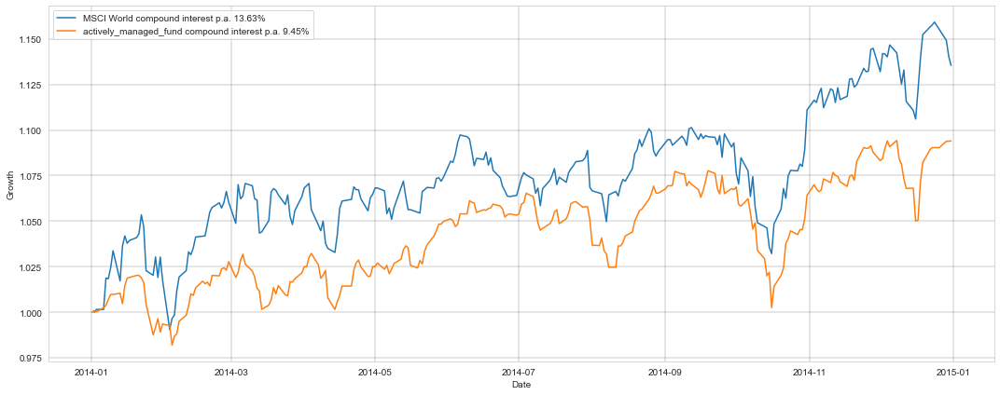
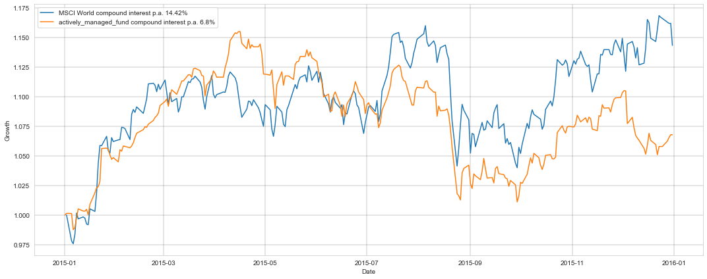
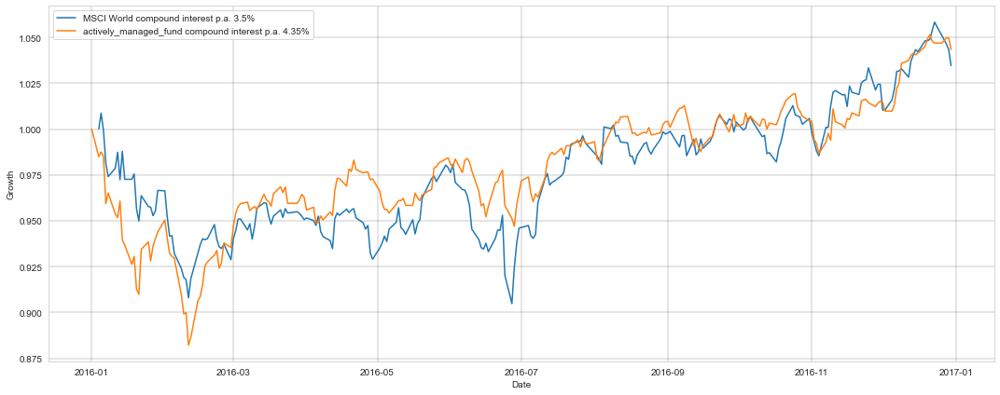
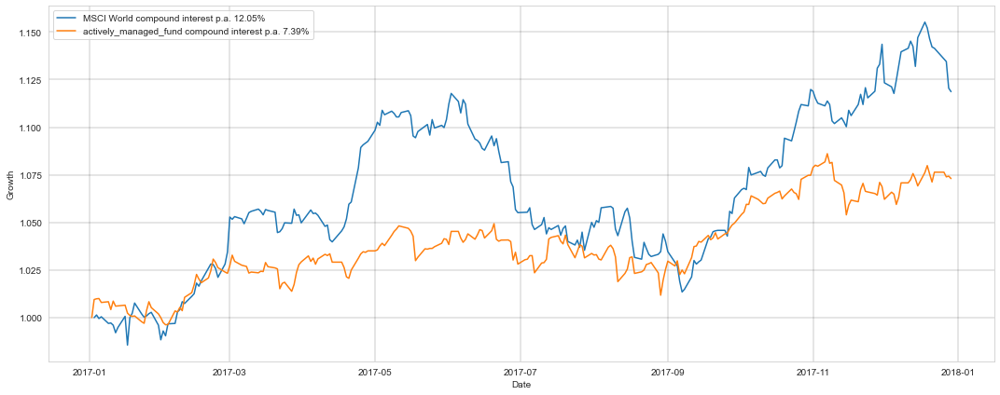
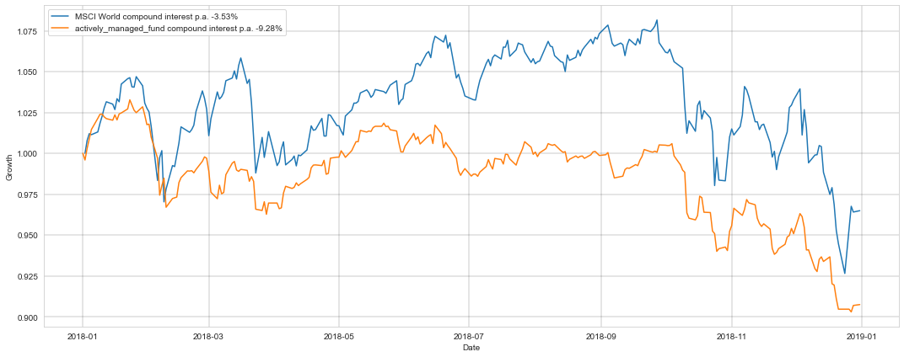
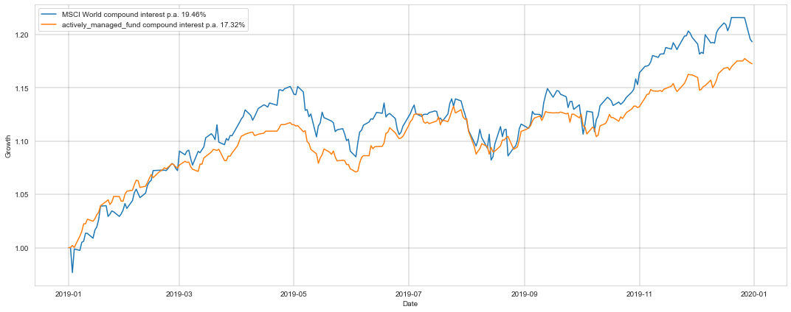
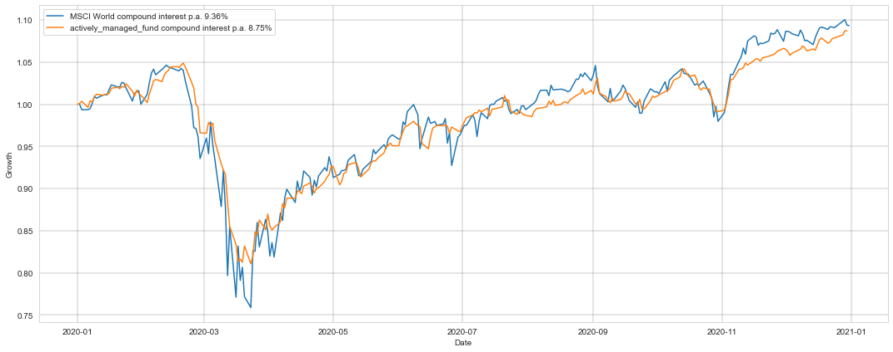
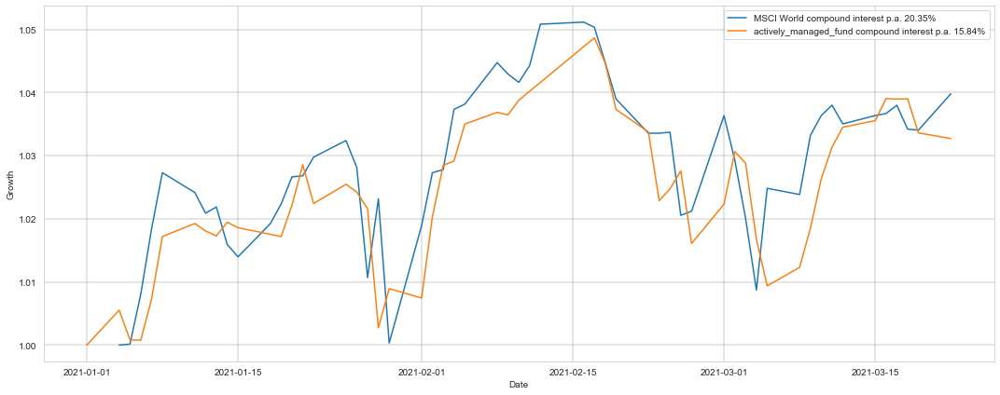
